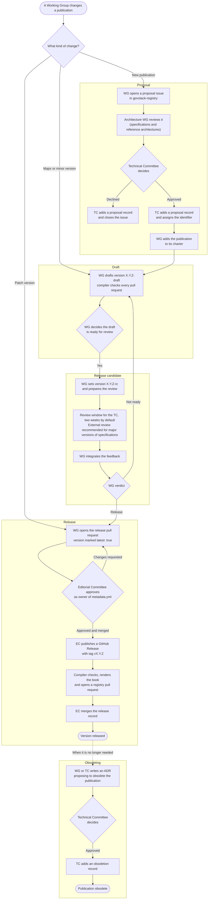

Every GovStack publication moves through the same stages: it is proposed, drafted, reviewed,
released and, when it is no longer needed, made obsolete. This chapter sets out each stage, who
approves it, and how a publication is reviewed. The Working Group that owns a publication does the
work (see `govstack_working_groups.md`). The decisions of the Technical Committee and the Editorial
Committee are recorded in the GovStack Registry (see *Records* in `govstack_registry.md`).

## Overview

The diagram shows the whole track. A new publication starts with a proposal. A major or minor
version starts as a draft. A patch version goes straight to its release pull request. Each stage is
described in the sections that follow.

## Stages

| Stage | In the repository | Starts when | Ends when | Approved by |
|---|---|---|---|---|
| Proposal | An issue in `govstack-registry`, opened from the *Publication Proposal* template | The issue is opened | The Technical Committee decides, and records the decision | Technical Committee |
| Draft | A version with the suffix `-draft` in `metadata.yml`, for example `2.0.0-draft` | The proposal is approved, or work on a minor or patch version starts | The Working Group decides the draft is ready for review | Working Group |
| Release candidate | A version with the suffix `-rc`, for example `2.0.0-rc` | The Working Group decides the draft is ready for review | The review is complete and the Working Group gives its verdict | Working Group |
| Released | A version with no suffix, marked `latest: true` | The Working Group opens the release pull request | The Editorial Committee publishes the release and merges its record | Editorial Committee |
| Obsolete | An obsoletion record in `govstack-registry` | The Working Group or the Technical Committee proposes it | The Technical Committee decides, and records the decision | Technical Committee |

Drafts and release candidates are checked by the compiler but not published, and their requirements
do not set a baseline (see `compiling_publications.md`).

Not every version goes through every stage:

| Change | Proposal | Draft | Release candidate and review | Release |
|---|---|---|---|---|
| New publication | Yes | Yes | Yes | Yes |
| Major version | No | Yes | Yes | Yes |
| Minor version | No | Yes | Yes. A review window for the Technical Committee | Yes |
| Patch version | No | Optional | No review | Yes |

## Proposals

A proposal asks for a new publication.

1. The Working Group opens an issue in `govstack-registry` with the *Publication Proposal* issue
   template. The same content is in `resources/publication_proposal_template.md`.
2. For a new specification or a reference architecture, the Architecture Working Group reviews the proposal: that it reflects the state of the art, follows the GovStack Architecture, and does not overlap with other Building Blocks.
3. The Technical Committee approves or declines the proposal. For a new publication, it assigns the
   publication's identifier (see *Requesting an identifier* in `govstack_namespaces.md`).
4. The Technical Committee records its decision as a proposal record in `govstack-registry`, and
   closes the issue.

The issue's labels show the proposal's status, matching the `status` of the proposal template.
The labels are defined in `.github/labels.yml` of `govstack-registry`.

| Label | Status | Set by |
|---|---|---|
| `proposal` | Every proposal | The issue template |
| `draft` | `DRAFT`: still being written, not ready for review | The requestors |
| `under-review` | `UNDER REVIEW`: the Technical Committee is reviewing it | Technical Committee |
| `approved` | `APPROVED` | Technical Committee, with its proposal record |
| `declined` | `DECLINED` | Technical Committee, with its proposal record |

The Working Group adds an approved publication to its charter.

## Who does what

| Body | Role in the track |
|---|---|
| Working Group | Owns the publication. Proposes, drafts, runs the review, gives the verdict and opens the release pull request. |
| Technical Committee | Approves proposals for new publications, and assigns identifiers. Has a review window on every release candidate. Approves obsoleting. Records its decisions in the registry. |
| Editorial Committee | Approves release pull requests, publishes releases, and merges release records into the registry. |
| Architecture Working Group | Reviews proposals and drafts of specifications against the GovStack Architecture and the other Building Blocks. |

## Review

### Which review applies

| Publication | Major version | Minor version | Patch version |
|---|---|---|---|
| Specifications: `govstack:spec`, `govstack:spec:*`, `govstack:terminology*` | External review RECOMMENDED, and a review window for the Technical Committee | A review window for the Technical Committee | No review |
| Informative publications: `govstack:ra:*`, `govstack:guide:*` | A review window for the Technical Committee | A review window for the Technical Committee | No review |
| The GovStack Process: `govstack:process` | Review by the Technical Committee | Review by the Technical Committee | No review |

Every review is open to the Technical Committee. Informative publications need no external review.

A review window lasts two weeks by default. The Working Group can set a different length when it
prepares the review.

### Review phases

The Working Group runs the review:

1. **Preparation.** Review the text a final time. Update `RELEASE_NOTES.md` for a major version, or
   `CHANGELOG.md` for a minor or patch version. For an external review, shortlist reviewers, prepare
   a review form with instructions, and set the deadline and the minimum number of reviews.
2. **Announcement.** Send a short announcement to the Technical Committee, which opens its review
   window and distributes the announcement on GovStack's public channels.
3. **Review period.** Collect the reviews and share them with the members.
4. **Integration.** Decide how to handle each piece of feedback: integrate small changes into this
   version, and plan larger ones for a later version.
5. **Verdict.** Decide, in a plenary session, whether the release candidate becomes a release.

### Minimum requirements

1. The decisions to move to a release candidate, to integrate feedback and on the verdict follow
   the Working Group's decision making: consensus first, voting where consensus is not reached (see
   *Decision making* in `govstack_working_groups.md`).
2. An external review SHOULD be open to the public. It has at least two reviewers, and no reviewer
   is listed in the publication's `authors.yml` or belongs to an organization of an active member
   of the Working Group.

## Release

A Working Group member opens the release pull request, and the Editorial Committee approves it and
publishes the release. The compiler then renders the book and opens a pull request to
`govstack-registry` with the release record, which the Editorial Committee merges. The steps are
in *Releasing a version* in `compiling_publications.md`.

## Obsoleting

A publication becomes obsolete when it is no longer maintained or has been replaced.

1. The Working Group, or the Technical Committee when the Working Group is dissolved, writes an ADR
   in the `ADR/` folder of the publication's repository. The ADR gives the reasons and names the
   publication that replaces it, if any.
2. The Technical Committee approves or declines the ADR.
3. If it approves, the Technical Committee adds an obsoletion record to `govstack-registry`.

An obsolete publication stays published at its URLs, and the registry shows it as obsolete. The
compiler does not release new versions of it. Its identifier is never reassigned.
